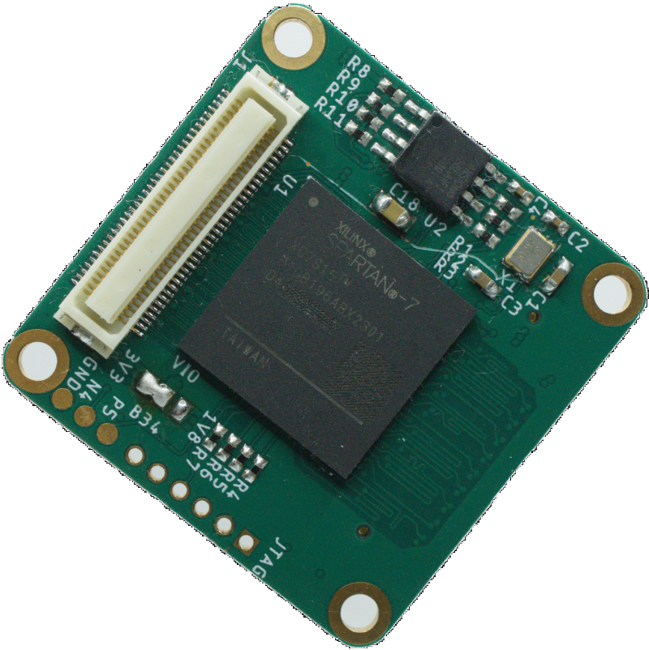

# ModularCamera Hardware

This repository contains the schematics and layouts for the PCBs that make up the ModularCamera system.
They are divided into three categories:

## Interface

This is the layer that connects the modularCamera to a PC. At the moment the following interfaces are implemented:

- USB3: Using a Cypress FX3 chip to communicate with a PC via an USB-C cable
- GigE: Providing a Gigabit Ethernet connection with an optional PoE add-on board

The boards are fully self contained, bringing all the power supplies and configuration memories they need.
To connect to the next layer, a 70 pin connector transports up to 42 signals plus 22x GND and 6x 5V.

## Processing

The central layer of the stack does everything from controlling the sensors,  processing the data and formatting it for output. Right now, there are two FPGA boards, but microcontrollers would also be possible.

- Spartan7: A XC72S15 FPGA from Xilinx
- Spartan6: A XC6SLX16 FPGA from Xilinx

Besides the FPGA, the boards have several power supplies for the FPGA, a configuration memory and a clock source. The connector to the next layer has  up to 42 signals plus 22x GND and 6x 5V.

## Sensor

This is were the modularity shines. With the high flexibility of the FPGAs, almost all sensors can be interfaced with minimal additional components.
The focus lies on image sensors, but the system isn't limited to processing pixels:

- AISC110C: A small image sensor with a resolution of 80x120 px but a maximum framerate of 40000fps! Configured via SPI.
- ADV7182: An SDTV Video Decoder that accepts lots of analog video formats. Configured via I2C.
- HallArray: An 8x8 array of hall sensors interfaced with an analog matrix. Makes magnetic fields visible.
- MT9P031: A 5MP B/W CMOS image sensor with 14fps. Configured via I2C.
- EV76C560: A 1.3MP B/W CMOS image sensor with global shutter and 60ps. Configured via SPI.
- LinearCCD: A board for interfacing several linear CCD arrays. Provides a driver chip for clocking&control signals, a step-up for power supply and up to 3 12bit 5MSPS ADCs. The sensors are connected via an additional board to accomodate for different pinouts.
- NOIP1SN300: A 1.3MP B/W CMOS image sensor with global shutter and up to 815fps. Configured via SPI.
- IBIS5-B-1300: A 1.3MP B/W CMOS image sensor with global shutter and 27fps. Configured via SPI. (WIP)
- Cameralink: A CameraLink-Base Interface with optional PoCL. Makes the modularCamera into a CameraLink framegrabber. (WIP)
- Microphone Array: A board containing three I2S MEMS microphones. (WIP)

The boards should provide everything necessary to operate the sensor. The connector to the lower layer provides 5V and the control/data interface.
